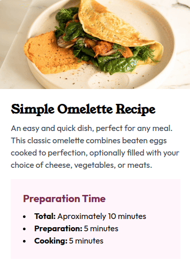

# Frontend Mentor - Recipe Nutrition Table Challenge

## 📄 Project Description

This project is part of a **Frontend Mentor challenge** to build a **responsive Recipe Nutrition Table**. The focus of the project is to practice:

- **HTML** for structure.
- **CSS** for styling.
- **Tailwind CSS** for a utility-first approach to layout and design.
- **BEM** methodology for maintainable and scalable CSS architecture.

The project helped me improve my skills in frontend development, responsive design, and modern web practices.

## 🚀 Live Demo

[View Live Demo](https://kenvastolord.github.io/Recipe_page)

## 🖼️ Screenshot

## 🛠️ Technologies Used

- **HTML5**
- **CSS3** with **BEM**
- **Tailwind CSS**
- **Frontend Mentor** for the challenge

## 🔑 Key Features

- **Responsive design** for mobile, tablet, and desktop screens.
- **Tailwind CSS** utilities for rapid layout and styling.
- **CSS Variables** for easy color management.
- **BEM** class naming convention for organized code.

## 🌟 What I Learned

- How to use **Tailwind CSS** for quick and efficient styling.
- The benefits of using **CSS Variables** for consistent design.
- Writing clean, maintainable code with the **BEM methodology**.
- Implementing responsive designs with **Tailwind breakpoints**.

## 👤 Author

- **GitHub**: [yourusername](https://github.com/kenvastolord)
- **LinkedIn**: [Your LinkedIn](https://linkedin.com/in/kenneth-delgado-g)

## 🛡️ Acknowledgments

- **Frontend Mentor** for providing great challenges.
- **Tailwind CSS** documentation for guidance.
